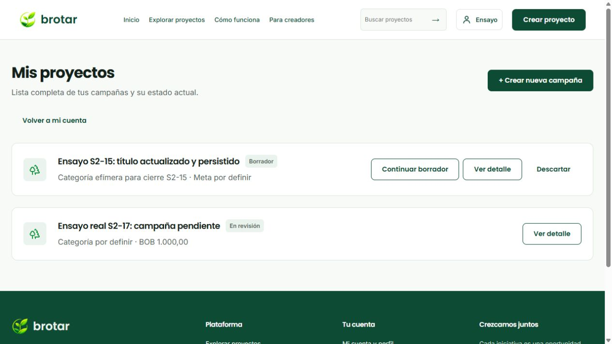
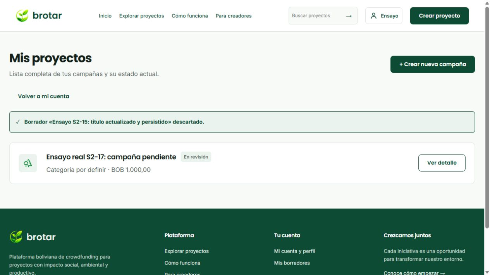
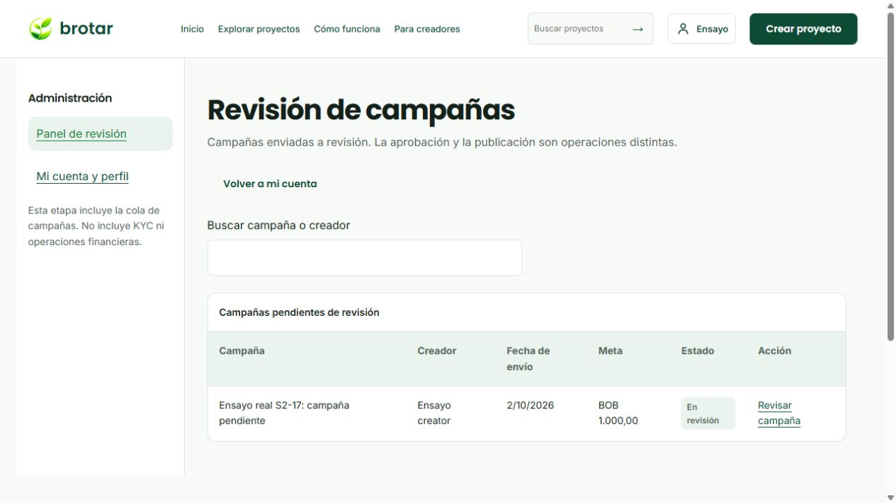
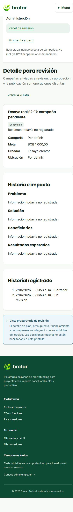

# Cierre técnico de proyectos propios y cola administrativa

Fecha: 02/10/2026. Responsable: Ricardo. Rama de entrega: `RicardoDev`.

Esta evidencia permite al equipo revisar el cumplimiento técnico de **S2-15 y S2-17**, según sus criterios en [planificacion-sprints.json](planificacion-sprints.json) y las tarjetas [S2-15](https://trello.com/c/tdYcbrv3) y [S2-17](https://trello.com/c/DUoK6ILY). Ambas tareas cumplen su alcance acotado. Esto no cierra las historias generales BG-13, BG-14 o BG-41, todo el Sprint 2 ni la aceptación externa de los líderes. Sustituye para estas dos tareas el estado parcial del informe del 01/10.

Código y evidencia publicados en el [commit 4dcd47a](https://github.com/luisrocha159/CrowFunding-Brotar/commit/4dcd47aaf9d90b06da0f4efb4fd009021f930fa3). Después se confirmó por lectura del conector que ambas tarjetas tienen `complete=true`, están en **04 · Terminadas · cierre técnico** y mantienen al responsable Ricardo y la etiqueta Sprint 2. Los criterios originales están cumplidos: **4/4 en S2-15 y 3/3 en S2-17**, además de sus comprobaciones de avance. Se retiró la etiqueta de verificación técnica pendiente, sin declarar aceptación externa ni cerrar tarjetas de historias generales. DEV y main permanecen intactas.

## Alcance completado

| Tarea y criterio | Implementación y evidencia |
| --- | --- |
| S2-15 1 Lista propia y acciones por estado | `/mis-proyectos` consulta la API real; cada tarjeta permite ver su detalle. Solo `DRAFT` muestra continuar y descartar. Continuar abre el UUID elegido, conserva información y recupera el paso guardado. |
| S2-15 2 Vacío, detalle, continuación y propiedad | Integración PostgreSQL y ensayo real de dos creadores: lista vacía del segundo, detalle ajeno no disponible, datos propios persistidos después de recargar y de volver a iniciar sesión. Prueba de renderizado para todos los estados de consulta. |
| S2-15 3 Evidencia y revisión del alcance | Revisión técnica contra el plan, este informe, pruebas automatizadas, capturas y commit publicado en `RicardoDev`. La aceptación de los líderes se mantiene separada. |
| S2-15 4 Descarte confirmado y actualización | Confirmación explícita; Escape cancela y conserva el borrador. La API solo descarta `DRAFT` propio, registra actor e historial en la misma transacción y realiza borrado lógico. La lista y el constructor dejan de ofrecerlo. Otro propietario recibe 404; estados no borrador reciben 409. |
| S2-17 1 Acceso, navegación, cola y entrada al detalle | Mi cuenta muestra acceso administrativo según el rol vigente; sidebar con cola y perfil. API privada lista solamente campañas `IN_REVIEW` no descartadas, con búsqueda por título/creador y acceso al detalle preparatorio. |
| S2-17 2 Permisos y estados de interfaz | Administrador permitido; creador y usuario básico rechazados por el servidor; anónimo requiere sesión. Se comprobó cola vacía, búsqueda sin coincidencias, carga, error y reintento. Una aprobación no se presenta como publicación. |
| S2-17 3 Evidencia y revisión del alcance | Pruebas HTTP con roles, integración PostgreSQL, ensayo de navegación real por teclado y ratón, detalle a 390 px y documentación publicada. No se incluye el motor de decisiones de S2-12. |

## Cambios finales de esta revisión

- El constructor ofrece **Volver a mis proyectos** al continuar un borrador concreto.
- Un enlace inválido, ajeno o descartado muestra **Borrador no disponible**. Al cambiar de selección no se presenta como vigente la información de la anterior mientras se carga la nueva.
- Las campañas no borrador se identifican como **Consultar**, sin insinuar que admiten edición.
- **Revisar campaña** tiene un área clicable continua y altura mínima de 44 px. Se corrigió el clic en el espacio entre las líneas del enlace.
- Se amplió la integración real para guardar información e historia, recuperar el paso en una sesión nueva y comprobar restricciones en `CHANGES_REQUESTED`, `APPROVED` y `PUBLISHED`.

## Pruebas y límites de la evidencia

La ejecución de cierre aprobó **101 pruebas frontend, 101 backend y 15 de integración PostgreSQL**, además de lint, TypeScript y compilaciones. Estos son conteos de pruebas, no 217 historias ni certificación de ausencia absoluta de errores. La suite de integración se ejecutó con `DB_TEST_RESTART=false`: comprobó reconexión/nueva sesión, no un reinicio del contenedor en este cierre.

El navegador utilizó Vite, NestJS, cookies de sesión y PostgreSQL V2 reales en `127.0.0.1:15433`. Se crearon tres cuentas y dos campañas efímeras, con contraseñas aleatorias privadas. Los roles y los estados de revisión se prepararon **solo en esos fixtures locales**, no mediante un flujo de provisión o aprobación terminado. Al finalizar se eliminaron exclusivamente esos datos y su categoría; no se alteraron cuentas ni campañas del equipo.

El estado vacío administrativo se comprobó al sacar del estado `IN_REVIEW` la única campaña de ensayo de la cola. El error se comprobó deteniendo la API iniciada para este ensayo y luego reiniciándola: se mostró un error distinto de una lista vacía y **Reintentar** recuperó la cola. El indicador de carga se comprobó también con una petición controlada sin respuesta en el ensayo visual aislado; ese caso usa respuestas simuladas, no una caída de PostgreSQL.

Docker volvió a responder tras apartar de forma recuperable dos directorios de sockets temporales inaccesibles. No se borró ningún volumen ni se restauró la base encima de datos existentes. El problema de sockets de Docker Desktop ha reaparecido y **no se declara resuelto definitivamente**; es distinto del cumplimiento funcional de estas dos tareas.

## Cómo repetir las comprobaciones

Seguir primero la instalación V2 del [README principal](../README.md). No iniciar la infraestructura antigua `infra/postgres`. No se publican cuentas con roles privilegiados ni claves de pruebas.

Desde la raíz del frontend:

```powershell
bun run check
```

Desde `backend/`, con la configuración V2 generada y Docker operativo:

```powershell
pnpm install --frozen-lockfile
node scripts/prepare-sprint2.mjs
pnpm run check
$env:ALLOW_DB_TEST_WRITES='true'
$env:DB_TEST_RESTART='false'
try {
  node --env-file=../infra/postgres-v2/.env.backend --test --test-concurrency=1 dist-test/integration/*.test.js
} finally {
  Remove-Item Env:\ALLOW_DB_TEST_WRITES
  Remove-Item Env:\DB_TEST_RESTART
}
```

Las pruebas exigen una base local V2 y limpian sus UUID propios; no ejecutarlas contra producción. `prepare-sprint2.mjs` prepara permisos del rol técnico de la conexión; **no convierte a personas en CREATOR o ADMIN**. Para revisar el navegador contra datos reales, utilizar cuentas con roles ya provisionados de manera autorizada y campañas de prueba propias:

1. Como creador, abrir **Mi cuenta → Opciones para iniciativas y permisos → Mis proyectos**. Consultar el detalle y continuar un borrador.
2. Guardar información general, recargar y comprobar persistencia. Volver a la lista usando el nuevo enlace.
3. Abrir **Descartar**, cancelar con Escape, comprobar que sigue presente, abrir otra vez y confirmar. Verificar la actualización de la lista y que el enlace anterior ya no permite continuar.
4. Con otro creador, comprobar que no aparece el proyecto ajeno y que su detalle no expone datos. Una campaña no borrador debe ofrecer consulta, no descarte.
5. Como administrador, abrir **Revisión de campañas**, buscar por título/creador y entrar al detalle por ratón o teclado. Sin el rol, comprobar la denegación. El alta de cuentas no concede administración.

Para ensayar **solo la presentación visual**, sin roles especiales ni escrituras en la base, iniciar Vite y abrir `/tests/visual-projects.html`. Agregar `?view=admin&case=loading`, `empty`, `error` o `forbidden` para estados controlados. La página muestra que los datos son ficticios y no forma parte de `dist`.

## Evidencia visual con datos efímeros

Las siguientes capturas corresponden al navegador conectado a la API y PostgreSQL reales, usando exclusivamente los fixtures descritos arriba.









## Trabajo que sigue separado

**S2-12** debe integrar toda la información del constructor y las decisiones de aprobar, rechazar o solicitar cambios con su registro. **S2-14** debe ejecutar transiciones y publicación, incluyendo la adaptación del esquema para `REJECTED`. **S2-21** debe comprobar el recorrido completo del equipo desde el constructor terminado hasta consulta pública. Sus estados continúan en curso; preparar fixtures no demuestra esos flujos.

La cola y su detalle comparten el repositorio/caso de uso de consulta que podrá reutilizar S2-12; todavía no constituyen la revisión administrativa completa. D06 sobre provisión definitiva de roles, D05 sobre quién publica y la aceptación externa siguen pendientes. No se habilita autoasignación de privilegios, KYC/KYB, pagos, estadísticas ni otras funciones fuera del alcance.
